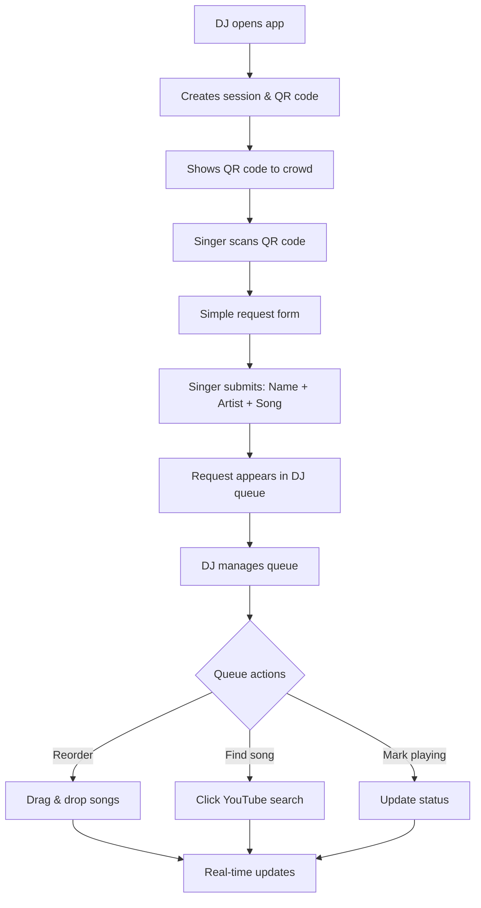
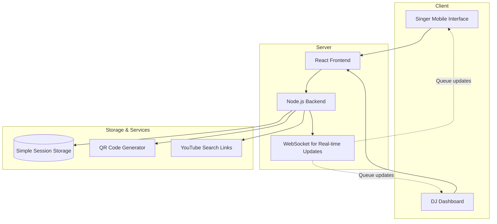
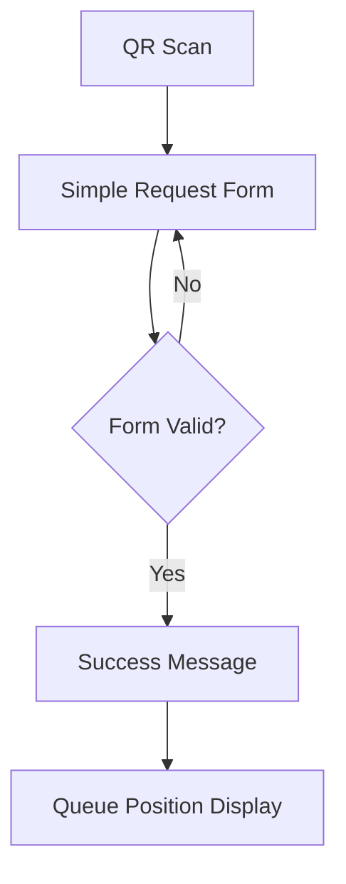
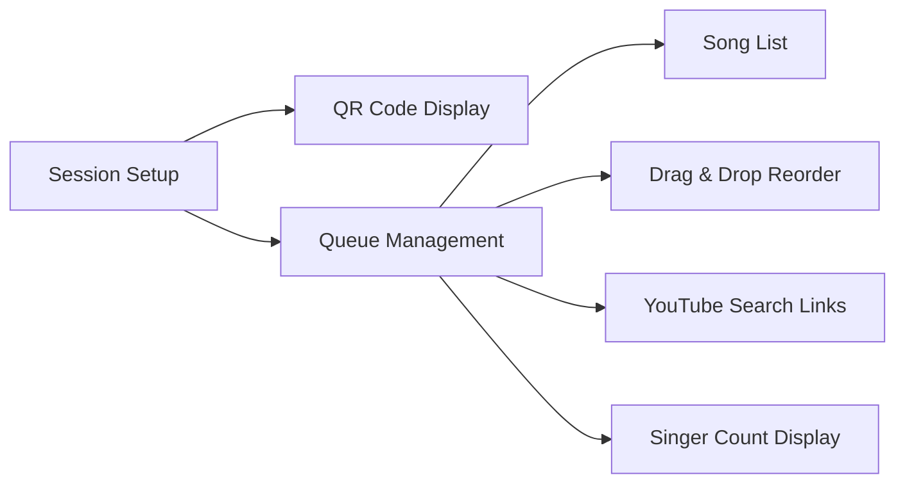

# Karaoke DJ Queue App 🎤

A simple karaoke song request and queue management tool for karaoke DJs working at bars.

## Problem Statement

As a karaoke DJ, managing song requests is challenging:
- **Paper requests get lost** or become illegible in busy bar environments
- **No visibility for singers** on their position in queue or wait times
- **Manual queue juggling** while trying to entertain the crowd
- **Disputes over queue order** when people can't see the list
- **Inefficient workflow** switching between managing requests and DJ duties

## Solution Overview

A simple web application that makes karaoke DJ work easier:

**For Singers:** Mobile-friendly song request form - just scan QR code, enter name/artist/song, done.

**For DJ:** Clean queue management interface with drag-and-drop reordering and quick YouTube search links.

## User Flow Architecture

## System Architecture

## Core Features

### Singer Experience
- **Quick Request Submission** - Name, artist, song in under 30 seconds
- **Queue Visibility** - See position and estimated wait time
- **Mobile Optimized** - Touch-friendly interface, no app download needed

### DJ Experience
- **Simple Session Setup** - Generate QR code and start accepting requests
- **Clean Queue Dashboard** - Clear list of requests with essential details
- **Easy Reordering** - Drag & drop to rearrange queue
- **YouTube Integration** - Quick search links for finding karaoke tracks
- **Singer Tracking** - See who has sung and how many times

## Technical Specifications

### Data Models

**Session Management**
- Simple session codes for QR generation
- Configurable song duration (default: 4.5 minutes)

**Singer Tracking**
- Basic name deduplication (e.g., "John (2)")
- Count of how many times each person has sung

**Queue Management**
- Real-time position updates via WebSocket
- Simple status tracking (waiting → playing → done)
- Basic wait time estimates

### Performance Requirements

- **Concurrent Users:** Support 20-30 singers (typical bar karaoke night)
- **Real-time Updates:** Fast queue synchronization
- **Mobile Performance:** Quick loading for song requests
- **Session Capacity:** Handle 100+ songs in single queue

## User Interface Mockups

### Singer Mobile View

### DJ Dashboard

## Implementation Phases

### Phase 1: Core Functionality
- Session creation and QR code generation
- Simple song request form with validation
- Basic queue display for DJ
- YouTube search URL generation
- Singer name deduplication

### Phase 2: Enhanced DJ Experience
- Drag & drop queue reordering
- Real-time WebSocket updates
- Wait time calculations and display
- Basic singer statistics (song count)

### Phase 3: Polish & Optimization
- Mobile interface improvements
- Session persistence
- Performance optimization
- Simple success feedback for singers

## Getting Started

1. **Build the core functionality** - Session creation, QR codes, and basic queue
2. **Test with real karaoke DJ** - Get feedback on workflow and interface
3. **Add real-time features** - WebSocket updates and drag-and-drop reordering
4. **Polish the mobile experience** - Optimize for singer ease of use

